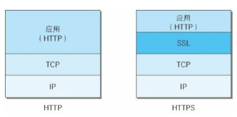
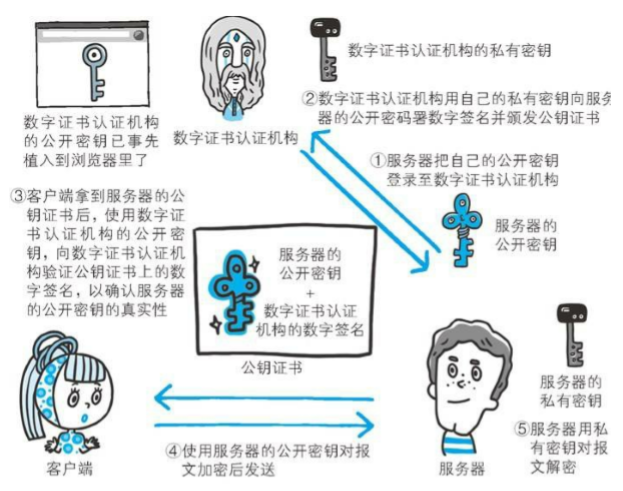
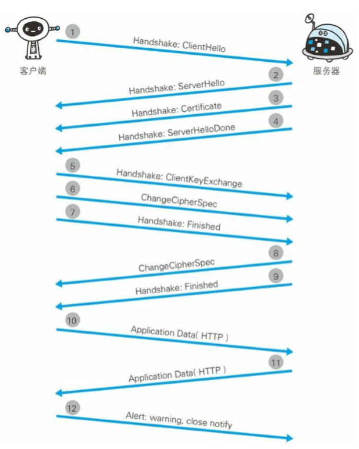
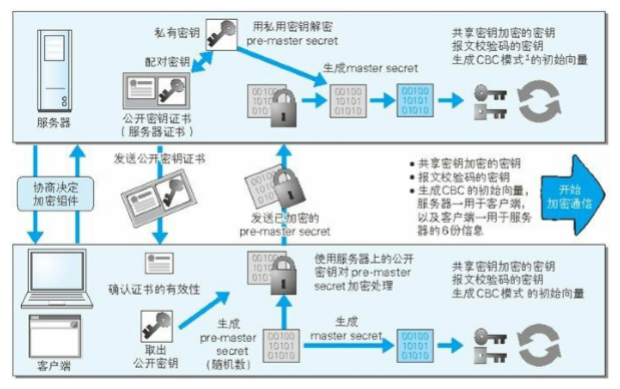

## HTTP 的缺点

​		主要有以下不足：

- 通信使用明文（不加密），内容可能会被窃听。
- 不验证通信双方的身份，因此有可能遭遇伪装。
- 无法验证报文的完整性，所以可能被篡改。

​        其他未加密的协议中也会存在这类问题。

​		Web 应用也可能存在安全漏洞。

### 通信使用明文可能会被窃听

- TCP/IP 是可能被窃听的网络

    所以加密、未加密都有可能被窃取到报文，但加密过的报文信息难以被破解。

- 加密处理防止被窃听

    - 通信的加密

        通过和 SSL 或 TLS 的组合使用，加密 HTTP 的通信内容。用 SSL 建立安全通信线路之后，就可以在这条线路上进行 HTTP 通信了。被称为 HTTPS（HTTP Secure）或 HTTP over SSL。

    - 内容的加密

        对实体主体部分进行加密。需要客户端、服务器协商加密解密。但由于通信线路未被加密，所以内容仍有可能被篡改。

### 不验证通信双方的身份就可能遭遇伪装

- 任何人都可发起请求

    - 无法确定请求发送至目标的 Web 服务器是否是按真实意图返回响应的那台服务器。有可能是已伪装的 Web 服务器。
    - 无法确定响应返回到的客户端是否是按真实意图接收响应的那个客户端。有可能是已伪装的客户端。
    - 无法确定正在通信的对方是否具备访问权限。因为某些 Web 服务器上保存着重要的信息，只想发给特定用户通信的权限。
    - 无法判定请求是来自何方、出自谁手。
    - 即使是无意义的请求也会照单全收。无法阻止海量请求下的 DoS 攻击（Denial of Service，拒绝服务攻击）。

- 查证对手的证书

    SSL 不仅提供加密处理，还使用了一种被称为证书的手段，可用于确定通信方。

    证书由值得信任的第三方机构颁发，用以证明服务器和客户端是实际存在的。

    通过使用证书，以证明通信方就是意料中的服务器。这对使用者个人来讲，也减少了个人信息泄露的危险性。

    客户端持有证书即可完成个人身份认证，还可以用于对 Web 网站的认证环节

### 无法证明报文完整性，可能已遭篡改

- 接收到的内容可能有误。

    HTTP 协议无法证明通信的报文完整性，所有没有办法证明发出与接收的请求和响应是前后相同的。在请求或响应传输途中，早攻击者拦截并篡改内容的攻击称为中间人攻击（Man-in-the-Middle attack，MITM）。

- 如何防止篡改。

    使用 MD5 和 SHA-1 等散列值校验的方法，但实际上并不便捷、可靠。

## HTTP + 加密 + 认证 + 完整性保护 = HTTPS

- 通过加密解决通信过程被窃听的问题。
- 通过认证解决不能确认通信双方的问题。
- 还需要考虑报文在通信过程中被篡改的问题。

### HTTPS 是身披 SSL 外壳的 HTTP

​		HTTPS 并非是一种新协议。

​		通常，HTTP 直接和 TCP/IP 通信。

​		使用 SSL 时，则变成 HTTP 先和 SSL 通信，再由 SSL 和 TCP 通信。如图：

​		采用 SSL 后，HTTP 就拥有了 HTTPS 的加密、证书、完整性保护这些功能。

​		SSL 是独立于 HTTP 的协议，其他在应用层的 SMTP、Telnet 等协议均可配合 SSL 使用。SSL 是应用最为广泛的网络安全技术。

### 相互交换密钥的公开密钥加密技术

​		SSL 采用 公开密钥加密（Public-key cryptography）的加密处理方式。

​		近代的加密方法中，加密算法是公开的，而密钥是保密的。通过这种方式得以保证加密方法的安全性。

​		加密和解密都会用到密钥。任何人只要持有密钥就能解密。

#### 共享密钥加密的困境

​		加密和解密用同一个密钥的方式成为共享密钥加密（Common key crypto system），也叫对称密钥加密。

​		以共享密钥方式加密时，必须将密钥也发送给对方。但究竟怎样才能安全地转交密钥？

#### 使用两把密钥的公开密钥加密

​		公开密钥加密方式很好地解决了共享加密密钥的困难。

​		公开密钥使用一对非对称的密钥。一把叫做私有密钥（private key），另一把叫做公开密钥（public key）。顾名思义，私钥不能让任何其他人知道，而公开密钥可以随意发布，任何人都可获得。

​		使用公开密钥加密方式，发送密文的一方使用对方的公开密钥进行加密处理；对方接受到被加密的信息后，再使用自己的私有密钥进行解密。这样就不必担心密钥被攻击者盗走。

#### HTTPS 采用混合加密机制

​		HTTPS 采用上述两种并用的混合加密机制。因为公开密钥的方式虽然较为安全，但速度较慢，故有如下混合方案：

​		交换密钥环节使用公开密钥加密方式，之后的建立通信交换报文阶段则使用共享密钥加密方式。

### 证明公开密钥正确性的证书

​		为了确定公开密钥本身的正确性，可以使用由数字证书认证机构（CA，Certificate Authority）和其相关机关颁发的公开密钥证书。

​		数字证书认证机构处于可信赖的第三方机构的立场上。认证流程如下图：

#### 可证明组织真实性的 EV SSL 证书

​		证书的一个作用是用来证明作为通信一方的服务器是否规范，另一个作用是可确认对方服务器背后运营的企业是否真实存在。拥有该特性的证书就是 EV SSL 证书（Extended Validation SSL Certificate）。

#### 用以确认客户端的客户端证书

​		作用于服务器证书一样，即证明客户端身份。通常需要客户手动安装。

#### 认证机构信誉第一

​		曾有黑客入侵证书颁发机构，撼动了 SSL 的可信度。

​		还有将证书无效化的证书吊销列表机制（Certificate Revocation List，CRL），以及从客户端删除根证书颁发机构的对策，但距离生效还需要一段时间。

#### 自由认证机构颁发的证书称为自签名证书

​		使用 OpenSSL 开源程序，每个人都可以构建自己的认证机构，从而给自己颁发服务器证书。但在互联网上不可作为证书使用。

​		浏览器使用自签名证书访问网站时，会跳出提示 “该网站的安全证书存在问题” 等消息。

#### 中级认证机构的证书可能会变成自认证证书

​		对于中级认证机构颁发的证书，某些浏览器会以正规证书来对待，有的浏览器会当做自签名证书。

### HTTPS 的安全通信机制

​		HTTPS 通信步骤如下：

1. 客户端发送 Client Hello 报文，开始通信。报文中包含客户端支持的 SSL 的指定版本、加密组件列表（所使用的的加密算法及密钥长度等）。
2. 服务器以 Server Hello 报文作为应答。同样，报文中包含 SSL 版本以及加密组件。服务器的加密组件内容是从接收到的客户端加密组件内筛选出来的。
3. 服务器发送 Certificate 报文。报文中包含公开密钥证书。
4. 服务器发送 Server Hello Done 报文通知客户端，最初阶段的 SSL 握手协商部分结束。
5. SSL 第一次握手结束后，客户端以 Client Key Exchange 报文作为回应。报文中包含通信加密中使用的一种被称为 Pre-master secret 的随机密码串。该报文已用步骤 3 中的公开密钥进行加密。
6. 客户端继续发送 Change Cipher Spec 报文，提示服务器，在此报文之后的通信会采用 Pre-master secret 密钥加密。
7. 客户端发送 Finished 报文。该报文包含连接至今全部报文的整体校验值。这次握手协商是否成功，要以服务器是否能够正确解密该报文为判定标准。
8. 服务器同样发送 Change Cipher Spec 报文。
9. 服务器同样发送 Finished 报文。
10. 服务器和客户端的 Finished 报文交换完毕后，SSL 连接就算建立完成。从此处开始进行应用层协议的通信，即发送 HTTP 请求。
11. 应用层协议通信，即 HTTP 响应。
12. 最后由客户端断开连接。断开连接时，发送 close_notify 报文。这一步之后，再发送 TCP FIN 报文来关闭与 TCP 的通信。

​        图例如下：

​		在以上流程中，应用层发送数据时会附加一种叫做 MAC（Message Authorization Code）的报文摘要。MAC 能够查知报文是否遭到篡改。

​		下面是对整个流程的图解。图中说明了从仅使用服务器端的公开密钥证书建立 HTTPS 通信的整个过程：

#### SSL 和 TLS

​		HTTPS 使用 SSL（Secure Socket Layer）和 TLS（Transport Layer Security）这两个协议。

#### SSL 速度慢吗

​		HTTPS 也存在问题，就是使用 SSL 时，处理速度会变慢 2 到 100 倍。

​		一是通信慢，除去 TCP 和 HTTP 报文的发送和响应外，还必须进行 SSL 通信。

​		二是大量消耗 CPU 和内存资源，进行加密、解密处理，导致处理速度变慢。