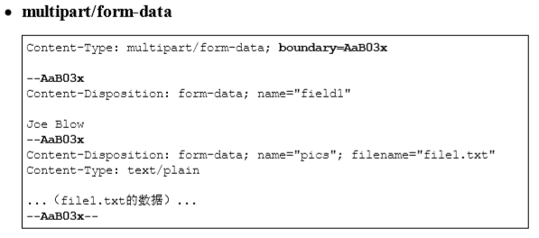
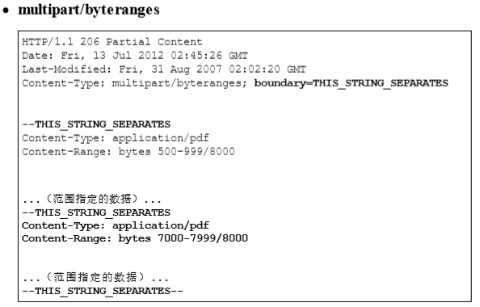

# 第三章 HTTP 报文内的 HTTP 信息

## HTTP 报文

​		HTTP 报文大致可分为报文首部和报文主体两块，由空行来划分（CR+LF）。报文主体不是必须的。

## 请求报文及响应报文的结构

​		请求报文首部结构：

- 请求行，包含请求方法、URI、HTTP 版本
- 请求首部字段
- 通用首部字段
- 实体首部字段
- 其他，可能包含 HTTP 的 RFC 里未定义的首部（Cookie 等）

​        响应报文首部结构：

- 状态行，包含状态码、原因短句、HTTP 版本
- 响应首部字段
- 通用首部字段
- 实体首部字段
- 其他，可能包含 HTTP 的 RFC 里未定义的首部（Cookie 等）

## 编码提升传输速率

​		HTTP 在传输时可以按照数据原貌直接传输，单也可以在传输过程中通过编码提升传输速率。

### 报文主体和实体主体的差异

- 报文（message）

    是 HTTP 通信中的基本单位，由 8 位组字节流组成，通过 HTTP 通信传输。

- 实体（entity）

    作为请求或响应的有效载荷数据被传输，其内容由实体首部和实体主体组成。

​        HTTP 报文的主体用于传输请求或响应的实体主体。

​		通常，报文主体等于实体主体。只有当传输中进行编码操作时，实体主体的内容发生变化，才导致它和报文主体产生差异。

### 压缩传输的内容编码

​		内容编码指明应用在实体内容上的编码格式，并保持实体信息原样压缩。内容编码后的实体由客户端接收并负责解压。常用的内容编码有以下几种：

- gzip（GNU zip）
- compress（UNIX 系统的标准压缩）
- deflate（zlib）
- identify（不进行编码）

### 分割发送的分块传输编码

​		在传输大容量内容数据时，通过把数据分割成多块，能够让浏览器逐步显示页面。这种把实体主体分块的功能称为分块传输编码（Chunked Transfer Coding）。

## 发送多种数据的多部分对象集合

​		发送邮件时，我们可以在邮件里写入文字，并添加多分附件，这是因为采用了 MIME（Multipurpose Internet Mail Extensions，多用途因特网邮件扩展）机制，它允许邮件处理文本、图片、视频等多个不同类型的数据。而在 MIME 扩展中会使用一种简称为多部分对象集合（Multipart）的方法，来容纳多份不同类型的数据。

​		相应的，HTTP 协议中也采纳了多部分对象集合，发送的一份报文主体内可包含有多类型实体。通常是在图片或文本文件等上传时使用。

​		在 HTTP 报文中使用多部分对象集合时，需要在首部字段里加上 Content-type 字段，有下面两个值：

-  multipart/form-data，Web 表单文件上传时使用。
- multipart/batyranges，状态码 206（Partial Content，部分内容）响应报文包含了多个范围的内容时使用。

​        使用 boundary 字符串来划分多部分对象集合指明的各类实体。在 boundary 字符串指定的各个实体的起始行之前插入 “--” 标记，如：--THIS_STRING_SEPARATES。在最后插入 “--” 作为结束，如：--THIS_STRING_SEPARATES--。

​		多部分对象集合的每个部分类型中，都可以含有首部字段。

​		下面是两个例子：

## 获取部分内容的范围请求

​		可以使用 Range 首部字段来指定资源的 byte 范围，例：

- Range: bytes=5001-10000 ，5001~10000字节。
- Range: bytes=5001- ，从 5001 字节之后全部。
- Range: bytes=0-3000, 5000-7000 ，从开始到 3000 字节和 5000 ~ 7000 字节的多重范围。

​        针对范围请求，响应会返回状态码为 206 的响应报文。

​		多余多重范围的范围请求，响应会在首部字段 Content-type 标明 multipart/byteranges 后返回响应报文。

​		如果服务器无法响应范围请求，则会返回状态码 200 OK 和完整的实体内容。

## 内容协商返回最合适的内容

​		当浏览器的默认语言为英文或中文，访问相同 URI 的 Web 页面时，则会显示对应的英文版或中文版的 Web 界面。这样的机制称为内容协商（Content Negotiation）。

​		包含在请求报文中的某些首部字段就是判断基准，会在后续章节详细说：

- Accept
- Accept-Charset
- Accept-Encoding
- Accept-Language
- Content-Language