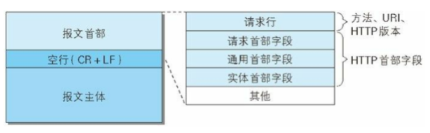
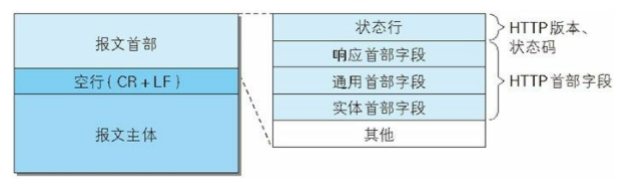

# 第六章 HTTP 首部

## HTTP 报文首部

### HTTP 请求报文

​		在请求中，HTTP 报文由方法、URI、HTTP 版本、HTTP 首部字段等部分构成，结构如下：



### HTTP 响应报文

​		在响应中，HTTP 报文由 HTTP 版本、状态码、HTTP 首部字段构成，结构如下：




## HTTP 首部字段

### HTTP 首部字段传递重要信息

​		HTTP 首部字段能起到传递额外重要信息的作用。它给浏览器和服务器提供报文主体大小、所使用的的语言、认证信息等内容。

### HTTP 首部字段结构

​		首部字段名: 字段值

### 4 种 HTTP 首部字段类型

#### 通用首部字段（General Header Fields）

​		请求报文和响应报文两方都会使用的首部：

| 首部字段名        | 说明                       |
| ----------------- | -------------------------- |
| Cache-Control     | 控制缓存的行为             |
| Connection        | 逐跳首部、连接的管理       |
| Date              | 创建报文的日期时间         |
| Pragma            | 报文指令                   |
| Trailer           | 报文末端的首部一览         |
| Transfer-Encoding | 指定报文主体的传输编码方式 |
| Upgrade           | 升级为其他协议             |
| Via               | 代理服务器的相关信息       |
| Warning           | 错误通知                   |


#### 请求首部字段（Request Header Fields）

​		从客户端向服务器端发送请求报文时使用的首部。补充了请求的附加内容、客户端信息、响应内容相关优先级等信息：

| 首部字段名          | 说明                                            |
| ------------------- | ----------------------------------------------- |
| Accept              | 用户代理可处理的媒体类型                        |
| Accept-Charset      | 优先的字符集                                    |
| Accept-Encoding     | 优先的编码内容                                  |
| Accept-Language     | 优先的语言（自然语言）                          |
| Authorization       | Web 认证信息                                    |
| Expect              | 期待服务器的特点行为                            |
| From                | 用户的电子邮箱地址                              |
| Host                | 请求资源所在的服务器                            |
| If-Match            | 比较实体标记（ETag）                            |
| If-Modified-Since   | 比较资源的更新时间                              |
| If-None-Match       | 比较实体标记（与 If-Match 相反）                |
| If-Range            | 资源未更新时发送实体 Byte 的范围请求            |
| If-Unmodified-Since | 比较资源的更新时间（与 If-Modified-Since 相反） |
| Max-Forwards        | 最大传输逐跳数                                  |
| Proxy-Authorization | 代理服务器要求客户端的认证信息                  |
| Range               | 实体的字节范围请求                              |
| Referer             | 对请求中 URI 的原始获取方                       |
| TE                  | 传输编码的优先级                                |
| User-Agent          | HTTP 客户端程序的信息                           |


#### 响应首部字段（Response Header Fields）

​		从服务器端向客户端返回响应报文时使用的首部。补充了响应的附加内容，也会要求客户端附加额外的内容信息：

| 首部字段名         | 说明                         |
| ------------------ | ---------------------------- |
| Accept-Ranges      | 是否接收字节范围请求         |
| Age                | 推算资源创建经过时间         |
| ETag               | 资源的匹配信息               |
| Location           | 令客户端重定向至指定 URI     |
| Proxy-Authenticate | 代理服务器对客户端的认证信息 |
| Retry-After        | 对再次发起请求的时机要求     |
| Server             | HTTP 服务器的安装信息        |
| Vary               | 代理服务器缓存的管理信息     |
| WWW-Authenticate   | 服务器对客户端的认证信息     |


#### 实体首部字段（Entity Header Fields）

​		针对请求报文和响应报文的实体部分使用的首部。补充了资源内容更新时间等与实体有关的信息：

| 首部字段名       | 说明                         |
| ---------------- | ---------------------------- |
| Allow            | 资源可支持的 HTPP 方法       |
| Content-Encoding | 实体主体适用的编码方式       |
| Content-Language | 实体主体的自然语言           |
| Content-Length   | 实体主体的大小（单位：字节） |
| Content-Location | 替代对应资源的 URI           |
| Content-MD5      | 实体主体的报文摘要           |
| Content-Range    | 实体主体的位置范围           |
| Content-Type     | 实体主体的媒体类型           |
| Expires          | 实体主体过期的日期时间       |
| Last-Modified    | 资源的最后修改日期时间       |


### 非 HTTP/1.1 首部字段

​		还有 Cookie、Set-Cookie、Content-Disposition 等首部字段的使用频率也很高。

### End-to-end 首部和 Hop-by-hop 首部

​		HTTP 首部字段将定义成缓存代理和非缓存代理的行为，分成两种类型：

- 端到端首部

    分在此类别中的首部会转发给请求/响应对应的最终接收目标，且必须保存在由缓存生成的响应中，另外规定它必须被转发。

- 逐跳首部

    分在此类别中的首部只对单次转发有效，会因通过缓存或代理而不再转发。HTTP/1.1 和之后版本中，如果要使用 hop-by-hop 首部，需提供 Connection 首部字段。

​        下面列举了 HTTP/1.1 中的逐条首部字段。除这 8 个首部字段之外，其他所有字段都属于端到端首部。

- Connection
- Keep-Alive
- Proxy-Authenticate
- Proxy-Authorization
- Trailer
- TE
- Transfer-Encoding
- Upgrade


## HTTP/1.1 通用首部字段

### Cache-Control

​		通过指定首部字段 Cache-Control 的指令，就能操作缓存的工作机制。

​		指令的参数是可选的，多个指令之间通过 “,” 分隔。可用于请求和响应。

#### 缓存请求指令

| 指令             | 参数   | 说明                         |
| ---------------- | ------ | ---------------------------- |
| no-cache         | 无     | 强制向源服务器再次验证       |
| no-store         | 无     | 不缓存请求或响应的任何内容   |
| max-age=[秒]     | 必须   | 响应的最大 Age 值            |
| max-stale(=[秒]) | 可省略 | 接收已过期的响应             |
| min-fresh=[秒]   | 必须   | 期望在指定时间内的响应仍有效 |
| no-transform     | 无     | 代理不可更改媒体类型         |
| only-if-cache    | 无     | 从缓存获取资源               |
| cache            | -      | 新指令标记（token）          |

#### 缓存响应指令

| 指令             | 参数   | 说明                                           |
| ---------------- | ------ | ---------------------------------------------- |
| public           | 无     | 可向任意方提供响应的缓存                       |
| private          | 可省略 | 仅向特定用户返回响应                           |
| no-cache         | 可省略 | 缓存前必须先确认其有效性                       |
| no-store         | 无     | 不缓存请求或响应的任何内容                     |
| no-transform     | 无     | 代理不可更改媒体类型                           |
| must-revalidate  | 无     | 可缓存但必须再向源服务器进行确认               |
| proxy-revalidate | 无     | 要求中间缓存服务器对缓存的响应有效性再进行确认 |
| max-age=[秒]     | 必须   | 响应的最大 Age 值                              |
| s-maxage=[秒]    | 必须   | 公共缓存服务器对响应的最大 Age 值              |
| cache-extension  | -      | 新指令标记（token）                            |

#### 表示是否能缓存的指令

- public 指令，表明其他用户也可以利用缓存。
- private 指令，响应只以特定的用户作为对象。缓存服务器会对该特定用户提供资源缓存的服务，对于其他用户发送过来的请求，代理服务器则不会返回缓存。
- no-cache 指令，防止从缓存中返回过期的资源。
    - 若请求头中包含 no-cache 指令，表示客户端将不会接收缓存过的响应，所以中间的缓存服务器必须把客户端请求转发给源服务器。
    - 若响应头中包含 no-cache 指令，表示缓存服务器不能对资源进行缓存。

#### 控制可执行缓存的对象的指令

- no-store，暗示请求（和对应的响应）或响应中包含机密信息，缓存不能在本地存储请求或响应的任一部分。

#### 指定缓存期限和认证的指令

- s-maxage 指令，功能和 max-age 相同，不同点在于 s-maxage 指令只适用于供多位用户使用的公共缓存服务器（一般指代理）。也就是说，对于向同一用户重复返回响应的服务器来说，这个指令没有任何作用。

- max-age 指令。

    - 请求头中包含 max-age 时，如果判定缓存资源的缓存时间数值比指定时间的数值更小，那么客户端就接收缓存的资源。另外，当 max-age = 0 时，缓存服务器通常需要将请求转发给源服务器。
    - 响应头中包含 max-age 时，缓存服务器将不对资源的有效性再做确认，而 max-age 数值代表资源保存为缓存的最长时间。

- min-fresh 指令，要求缓存服务器返回至少还未过指定时间的缓存资源。例如，当指定 min-fresh 为 60 秒后，在这 60 秒以内如果有超过有效期限的资源都无法作为响应返回了。

- max-stale 指令，指示缓存资源，即使过期也照常接收。若未指定数值，则无论过期多久都会接收。若指定数值，则过期并在指定时间内都能接收。

- only-if-cached 指令，要求缓存服务器不重新加载响应，也不会再次确认资源有效性。若发生请求缓存服务器的本地缓存无响应，则返回状态码 504 Gateway Timeout。

- must-revalidate 指令，代理会向源服务器再次验证即将返回的响应缓存目前是否任然有效。

    若代理无法连通源服务器再次获取有效资源的话，缓存必须给客户端一条 504 状态码。

- proxy-revalidate 指令，要求所有的缓存服务器在接收到客户端带有该指令的请求返回响应之前，必须再次验证缓存的有效性。

- no-transform 指令，规定无论是在请求还是响应中，缓存都不能改变实体主体的媒体类型。

- cache-extension token，使用这个扩展，可以添加自定义的指令，但要客户端与服务器端有约定，否则会被忽略。


### Connection

​		Connection 首部字段具备如下两个作用：

- 控制不再转发给代理的首部字段

    Connection: 不再转发的首部字段名

    可控制不再转发给代理的首部字段。

- 管理持久连接

    - Connection: close

        HTTP/1.1 版本的默认连接都是持久连接，为此，客户端会在持久连接上连续发生请求。当服务器端想明确断开连接时，则指定 Connection 首部字段为 close。

    - Connection: keep-alive

        HTTP/1.1 之前的版本默认连接都是非持久连接。为此，如果想在旧版本的 HTTP 协议上维持持续连接，则需要指定 Connection 首部为 keep-alive。


### Date

​		Date 表明创建 HTTP 报文的日期和时间


### Pragma

​		Pragma 是 HTTP/1.1 之前的历史遗留字段，唯一值为：

Pragma: no-cache

​		只在客户端发送的请求中，要求所有中间服务器不返回缓存的资源。

​		若所有中间服务器都以 HTTP/1.1 为基准，那么直接采用 Cache-Control：no-cache 即可。若要兼容老版本则应该两个都发送。


### Trailer

​		说明在报文主体后记录了哪些首部字段。该字段可应用在 HTTP/1.1 版本分块传输编码时。


### Transfer-Encoding

​		规定传输报文主体时采用的编码方式。


### Upgrade

​		检测 HTTP 协议及其他协议是否可使用更高的版本进行通信，其参数可以指定一个完全不同的通信协议。

​		使用 Upgrade 时，需要额外指定 Connection：Upgrade。例：

Upgrade: TLS/1.0, HTTP/1.1

Connection: Upgrade

​		对于附有首部字段 Upgrade 的请求，服务器可以用 101 Switching Protocols 状态码作为响应返回。


### Via

​		追踪客户端与服务器之间的请求和响应报文的传输路径。报文经过代理和网关时，会附加该服务器的信息，再进行转发。

​		Via 还可避免请求回环的发生。所以必须在经过代理时附加 该字段。

​		Via 经常会和 TRACE 方法一起使用。


### Warning

​		HTTP/1.1 的 Warning 是从 HTTP/1.0 的响应首部 Retry-After 演变过来的，通常用于告知用户一些与缓存相关的问题的警告。格式如下，日期可省略：

Warning: [警告码] [警告的主机:端口号] "[警告内容]" ([日期时间])

​		HTTP/1.1 有 7 种警告，以后可能会新增，现有类型如下：

| 警告码 | 警告内容                                         | 说明                                                         |
| ------ | ------------------------------------------------ | ------------------------------------------------------------ |
| 110    | Response is stale（响应已过期）                  | 代理返回已过期的资源                                         |
| 111    | Revalidation failed（再验证失败）                | 代理再验证资源有效性时失败（服务器无法到达等原因）           |
| 112    | Disconnection operation（断开连接操作            | 代理与互联网连接被故意切断                                   |
| 113    | Heuristic expiration（试探性过期）               | 响应的使用期超过24小时（有效缓存的设定时间大于24小时的情况下） |
| 199    | Miscellaneous warning（杂项警告）                | 任意的警告内容                                               |
| 214    | Transformation applied（使用了转换）             | 代理对内容编码或媒体类型等执行了某些处理时                   |
| 299    | Miscellaneous persistent warning（持久杂项警告） | 任意的警告内容                                               |


## 请求首部字段

### Accept

​		通知服务器，用户代理能够处理的媒体类型及媒体类型的相对优先级。如：

- 文本文件

    text.html, text/plain, text/css...

    application/xhtml+xml, application/xml...

- 图片文件

    image/jpeg, image/gif, image/png...

- 视频文件

    video/mpeg, video/quicktime...

- 应用程序使用的二进制文件

    application/octet-stream, application/zip...

​        若想要增加优先级，使用 q= 来额外表示权重值，用分号进行分隔，范围是 0~1，可精确到小数点后 3 位。不指定时，默认为 1.0 。

### Accept-Charset

​		通知服务器用户代理支持的字符集，及字符集的相对优先顺序，也用 q= 来指定。

### Accept-Encoding

​		通知服务器用户代理支持的内容编码，及内容编码的优先级顺序。有以下几种：

- gzip

    由文件压缩程序 gzip 生成的编码格式。

- compress

    由 UNIX 文件压缩程序 compress 生成的编码格式。

- deflate

    组合使用 zlib 格式及由 deflate 压缩算法生成的编码格式。

- identity

    不执行压缩，或不会变化的默认编码格式。

​        采用 q= 来表示相对优先级。可用通配符 * 表示指定任意编码格式。

### Accept-language

​		通知服务器用户代理能够处理的自然语言集，及其优先级。同样可用 q= 指定优先级权重。

### Authorization

​		告知服务器，用户代理的认证信息（证书值）。通常，想要通过服务器认证的用于代理会在接收到返回的 401 状态码响应后，把首部字段 Authorization 加入请求中。

### Expect

​		告知服务器，期望出现某种特定的行为（要客户端和服务端共同实现）。因服务器无法理解客户端的期望作出回应而发生错误时，会返回 417 Expectation Failed 状态码。

​		HTTP/1.1 只定义了 100-continue，即等待状态码 100 响应。

### From

​		告知服务器使用用户代理的用户的电子邮件地址。

### Host

​		告知服务器，请求的资源所处的互联网主机名和端口号。用于区分同一个 IP 的服务器上不同的域名（主机名）。Host 是 HTTP/1.1 规范内唯一一个必须被包含在请求内的首部字段。

### If-Match

​		形如 If-xxx 这样的首部，都可以成为条件请求。服务器在接收到附带条件的请求后，只有判断指定条件为真时，才会执行请求。

​		If-Match 告知服务器匹配资源所用的实体标记 ETag 值。这时的服务器无法使用弱 ETag 值。

​		服务器会对比 If-Match 的字段值与资源的 ETag 值，仅当两者一致时，才会执行请求。反之，则返回 412 Precondition Failed 状态码的响应。

​		使用 * 指定时，只有资源存在就处理请求。

### If-Modified-Since

​		告知服务器若该字段值早于资源的更新时间，则希望能处理该请求。若在指定 If-Modified-Since 字段值的日期之后，如果请求的资源都没更新过，则返回状态码 304 Not Nodified 的响应。

​		If-Modified-Since 用于确认代理或客户端拥有的本地资源的有效性。获取资源的更新日期时间，可通过确认首部字段 Last-Modified 来确定。

### If-None-Match

​		与 If-Match 作用相反。

### If-Range

​		告知服务器若指定的 If-Range 字段值（ETag值或时间）和请求资源的 ETag 值或时间相一致时，则作为返回请求处理。反之，则返回全体资源。

### If-Unmodified-Since

​		与 If-Modified-Since 作用相反。

### Max-Forwards

​		通过 TRACE 或 OPTIONS 方法，发送包含 Max-Forwards 首部的请求时，该字段以十进制指定可经过的服务器最大数目。

​		服务器在往下一个服务器转发前，会将该值减 1 。

​		当服务器接收到该值为 0 的请求时，则不再进行转发，而是直接返回响应。

### Proxy-Authorization

​		接收到从代理服务器发来的认证质询时，客户端会发生包含该首部的请求，以告知服务器认证所需要的信息。

### Range

​		告知服务器资源的指定范围。

​		服务器可处理时，返回 206 Partial Content 和响应。

​		服务器无法处理范围请求时，返回 200 OK 及全部资源。

### Referer

​		告知服务器请求的原始资源 URI。

### TE

​		告知服务器客户端能够处理响应的传输编码方式及相对优先级。

​		还可以指定伴随 trailer 字段的分块传输编码的方式。

### User-Agent

​		将创建请求的浏览器和用户代理名称等信息传达给服务器。


## 响应首部字段

### Accept-Ranges

​		告知客户端，服务器能否处理范围请求。有两个值：

- bytes，可处理范围请求。
- none，不能处理范围请求。

### Age

​		告知客户端，服务器在多久前创建了响应，单位为 秒。

​		若创建该响应的服务器是缓存服务器，Age 值是指缓存后的响应再次发起认证到认证完成的时间值。代理创建响应时必须加上首部字段 Age。

### ETag

​		告知客户端实体标记。它是一种可将资源以字符串形式做唯一标记的方式。服务器会为每份资源分配对应的 ETag 值。

- 强 ETag 值，无论实体发生多么细微的变化都会改变其值。
- 弱 ETag 值，只适用于提示资源是否相同。只有资源发生了根本改变，产生差异时才会改变 ETag 值，这时，会在字段值开始处附加 W/ 。

### Location

​		可以将响应接收方引导至某个与请求 URI 位置不同的资源。

​		基本上，该字段会配合 3xx：Redirection 的响应，提供重定向的 URI。几乎所有浏览器在接收到包含首部字段 Location 的响应后，都会强制性地尝试对已提示的重定向资源的访问。

### Proxy-Authenticate

​		会把由代理服务器所要求的认证信息发送给客户端。

### Retry-After

​		告知客户端应该在多久之后再次发送请求。主要配合 503 Server Unavailable 状态码响应，或与 3xx 一起使用。字段值也可以是具体的日期时间。

### Server

​		告知客户端当前服务器上安装的 HTTP 服务器应用程序的信息。

### Vary

​		对缓存进行控制。

### WWW-Authenticate

​		用于 HTTP 访问认证。告知客户端适用于访问请求 URI 所指定资源的认证方案（Basic 或 Digest）和带有参数提示的质询。状态码 401 Unauthorized 响应中，肯定带有该首部字段。


## 实体首部字段

​		用于补充内容的更新时间等与实体相关的信息。

### Allow

​		通知客户端能够支持 Request-URI 指定资源的所有 HTTP 方法。当服务器接收到不支持的 HTTP 方法时，会以 405 Method Not Allowed 状态码作为响应返回，同时还会把所有能支持的 HTTP 方法写入首部字段 Allow 中。

### Content-Encoding

​		告知客户端，服务器对实体的主体部分选用的内容编码方式。内容编码是指在不丢失实体信息的前提下进行的压缩，主要有 4 种内容编码方式（详情参考 Accept-Encoding 请求首部字段）：

- gzip
- compress
- deflate
- identity

### Content-Language

​		告知客户端，实体主体使用的自然语言。

### Content-Length

​		表明实体主体部分的大小，单位为字节。

​		对实体主体进行内容编码传输时，不能再使用 Content-Length 首部字段。

### Content-Location

​		给出与报文主体部分对应的 URI。

### Content-MD5

​		对报文主体执行 MD5 算法获得 128 位二进制数，再通过 Base64 编码后将结果写入该首部字段，用于检查报文主体在传输过程中是否保持完整。

​		采用这种方法，对内容上的偶发性改变是无从查证的，也无法检测出恶意篡改。因为实体主体和 Content-MD5 字段都有可能被同时篡改。

### Content-Range

​		针对范围请求，返回该首部字段，告知客户端作为响应返回的实体的哪个部分符合范围请求，单位为字节，包含当前发送范围及整个实体大小：

Content-Range：bytes 5001-10000/10000

### Content-Type

​		实体主体内对象的媒体类型，详情参考请求首部字段 Accept。

### Expires

​		告知客户端资源失效的日期。

### Last-Modified

​		资源最终修改的时间。


## 为 Cookie 服务的首部字段

​		Cookie 的工作机制是用户识别及状态管理。

| 首部字段名 | 说明                               | 首部类型     |
| ---------- | ---------------------------------- | ------------ |
| Set-Cookie | 开始状态管理所使用的的 Cookie 信息 | 响应首部字段 |
| Cookie     | 服务器接收到的 Cookie 信息         | 请求首部字段 |

### Set-Cookie

```
Set-Cookie: status=enable; expires=Tue, 05 Jul 2011 07:26:31 GMT; path=/; domain=.hackr.jp;
```

字段说明：

| 属性         | 说明                                                         |
| ------------ | ------------------------------------------------------------ |
| NAME=VALUE   | 赋予 Cookie 的名称和其值（必须项）                           |
| expires=DATE | Cookie 的有效期（若不明确指定，则默认为浏览器关闭为止）      |
| path=PATH    | 将服务器上的文件目录作为 Cookie 的适用对象（若不明确指定，则默认为文档所在的文件目录） |
| domain=域名  | 作为 Cookie 适用对象的域名（若不明确指定，则默认为创建 Cookie 的服务器的域名） |
| Secure       | 仅在 HTTPS 安全通信时才会发送 Cookie                         |
| HttpOnly     | 加以限制，使 Cookie 不能被 JavaScript 脚本访问               |

### Cookie

```
Cookie: statue=enable
```

​		告知服务器，当客户端想获得 HTTP 状态管理支持时，就会在请求中包含从服务器接收到的 Cookie。


## 其他首部字段

### X-Frame-Options

​		属于响应首部，用于控制网站内容在其他 Web 网站的 Frame 标签内的显示问题。其主要目的是为了防止点击劫持攻击。有下面两个值：

- DENY：拒绝。
- SAMEORIGIN：仅同源域名下的页面匹配时许可。

### X-XSS-Protection

​		属于响应首部，是针对跨站脚本攻击（XSS）的一种对策，用于控制浏览器 XSS 防护机制的开关。有下面两个值：

- 1，将 XSS 过滤设置成无效状态。
- 2，将 XSS 过滤设置成有效状态。

### DNT

​		属于请求首部，Do Not Track 的简称，意味拒绝个人信息被收集，是表示拒绝被精准广告追踪的一种方法。有下面两个值：

- 0，同意被追踪。
- 1，拒绝被追踪。

### P3P

​		属于响应首部，通过利用 P3P（The Platform for Privacy Preferences，在线隐私偏好平台）技术，可以让 Web 网站上的个人隐私变成一种仅供程序可理解的形式，以达到保护用户隐私的目的。

​		要进行 P3P 的设定，需要按以下操作步骤进行：

1. 创建 P3P 隐私。
2. 创建 P3P 隐私对照文件后，保存命名在 /w3c/p3p.xml。
3. 从 P3P 隐私中新建 Compact policies 后，输出到 HTTP 响应中。